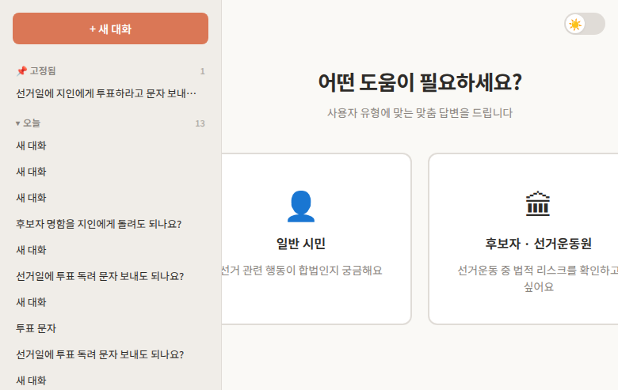
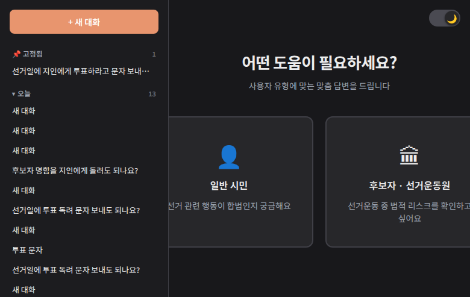
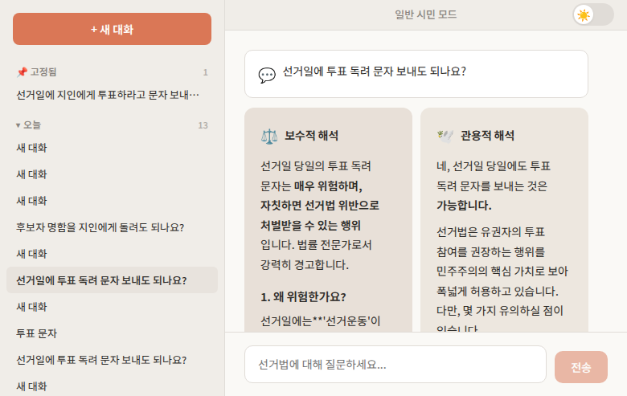
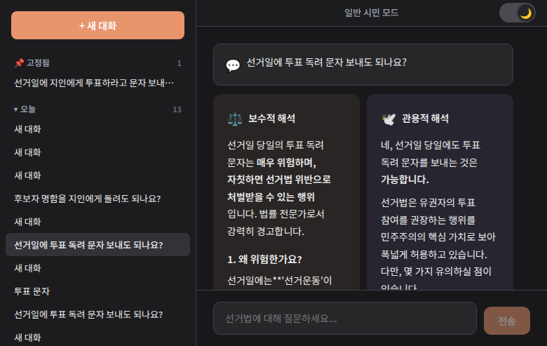
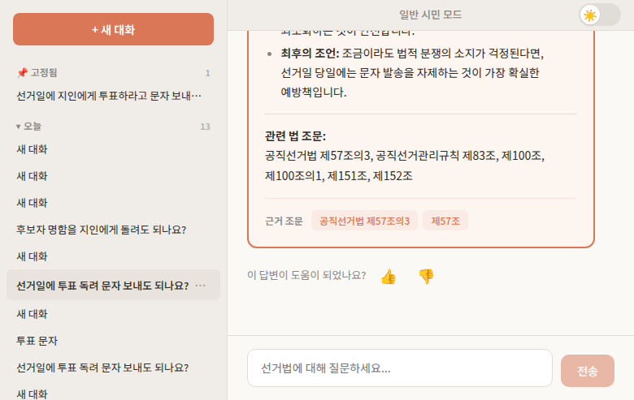

# 선거법 자문 에이전트

한국 선거법(공직선거법, 정치자금법, 정당법)에 기반하여 특정 행위가 선거법에 저촉되는지 판단하고 조언하는 **대화형 웹서비스**입니다.

두 명의 AI 에이전트(보수적/관용적)가 **실시간으로 동시에 토론**하고, 합의를 도출하여 위험도 등급과 함께 답변합니다.

## 스크린샷

### 모드 선택 화면

| 라이트 모드 | 다크 모드 |
|---|---|
|  |  |

### 듀얼 에이전트 토론

보수적 해석과 관용적 해석이 **동시에 스트리밍**되며, 하단에 합의 결론이 표시됩니다.

| 라이트 모드 | 다크 모드 |
|---|---|
|  |  |

### 합의 결론 및 피드백

위험도 뱃지(안전/주의/위반가능)와 근거 조문이 표시되며, 랜덤으로 평가 버튼이 노출됩니다.



## 주요 기능

- **듀얼 에이전트 토론**: 보수적 해석(엄격)과 관용적 해석(유연)이 동시에 분석 후 합의 도출
- **위험도 등급**: 안전 / 주의 / 위반가능 3단계 판정
- **위반 신고**: 위반가능 판정 시 중앙선관위 신고 페이지 바로가기 버튼 표시
- **법률 RAG**: 공직선거법 등 선거 관련 법률 + 시행령/시행규칙을 Hybrid Retrieval(BM25 + 벡터)로 검색
- **사례 기반 답변**: 중앙선관위 사례예시집(838건) 반영
- **조문 상호참조**: "제93조 -> 제58조 참조" 자동 추적
- **실시간 스트리밍**: SSE 기반 토큰 단위 병렬 스트리밍
- **다크 모드**: 라이트/다크 테마 토글 전환, 설정 유지
- **대화 이력**: SQLite 저장, 좌측 사이드바에서 열람
- **폴더 및 고정**: 대화를 폴더로 정리하고 상단 고정
- **질문 네비게이터**: 우측 미니맵으로 질문 간 빠른 이동
- **피드백 수집**: 랜덤으로 응답 평가(좋아요/싫어요) 수집
- **사용자 모드**: 일반 시민 / 후보자 및 선거운동원 맞춤 답변

## 기술 스택

| 구성 | 기술 |
|---|---|
| 프론트엔드 | SvelteKit (TypeScript) |
| 백엔드 | FastAPI (Python) |
| LLM | OpenRouter API - Gemini 3.1 Flash Lite |
| RAG | LangChain + ChromaDB + BM25 (rank_bm25) |
| 임베딩 | sentence-transformers (paraphrase-multilingual-MiniLM-L12-v2) |
| 데이터베이스 | SQLite (aiosqlite) |
| 실시간 통신 | SSE (Server-Sent Events) |
| 법률 데이터 | [legalize-kr](https://github.com/legalize-kr/legalize-kr) |

## 빠른 시작

### 사전 요구사항

- Python 3.12+
- Node.js 20+
- Git
- OpenRouter API 키 (아래 발급 방법 참고)

### OpenRouter API 키 발급

이 서비스는 [OpenRouter](https://openrouter.ai)를 통해 Gemini 3.1 Flash Lite 모델을 사용합니다.

1. [openrouter.ai](https://openrouter.ai) 에 접속하여 회원가입
2. [API Keys 페이지](https://openrouter.ai/keys) 에서 **Create Key** 클릭
3. 생성된 키 (`sk-or-v1-...` 형식)를 복사
4. 프로젝트의 `.env` 파일에 붙여넣기

무료 크레딧이 제공되며, 이후 사용량에 따라 과금됩니다. Gemini 3.1 Flash Lite는 저렴한 모델이므로 일반적인 사용에는 큰 비용이 발생하지 않습니다.

### 설치

```bash
git clone https://github.com/tokki1106/election-law-advisor.git
cd election-law-advisor

# 1. 환경 변수 설정
cp .env.example .env
# .env 파일을 열어 OPENROUTER_API_KEY에 발급받은 API 키 입력

# 2. Python 의존성 설치
python3 -m venv venv
source venv/bin/activate
pip install -r backend/requirements.txt

# 3. 프론트엔드 설치
cd frontend && npm install && cd ..

# 4. 법률 데이터 클론 및 인덱싱 (최초 1회, 약 5분 소요)
python3 scripts/index_laws.py

# 5. 프론트엔드 빌드
cd frontend && npm run build && cd ..

# 6. 서버 시작
./start.sh
```

브라우저에서 http://localhost:8000 접속

### 간편 실행 (설치 완료 후)

```bash
./start.sh
```

### 다른 LLM 모델 사용

`backend/agents/__init__.py`에서 모델을 변경할 수 있습니다:

```python
def get_llm() -> ChatOpenAI:
    return ChatOpenAI(
        model="google/gemini-3.1-flash-lite-preview",  # 여기를 변경
        ...
    )
```

OpenRouter에서 지원하는 모든 모델을 사용할 수 있습니다. [모델 목록](https://openrouter.ai/models)을 참고하세요.

## 프로젝트 구조

```
election-law-advisor/
  backend/
    main.py              # FastAPI 진입점 + 정적 파일 서빙
    database.py          # SQLite 스키마 (conversations, messages, feedbacks)
    routers/
      chat.py            # POST /api/chat - SSE 스트리밍 채팅
      conversations.py   # 대화 CRUD + 폴더/고정 API
      feedback.py        # 피드백 저장/조회 API
    agents/
      graph.py           # 듀얼 에이전트 워크플로우 (asyncio 병렬)
      conservative.py    # 보수적 해석 프롬프트
      liberal.py         # 관용적 해석 프롬프트
      consensus.py       # 합의 도출 프롬프트
      query_analyzer.py  # 쿼리 분석 및 법률 용어 변환
    rag/
      indexer.py         # 법률 조문 + 사례예시집 청킹 및 인덱싱
      retriever.py       # Hybrid Retrieval (BM25 + 벡터 + RRF)
      cross_ref.py       # 조문 상호참조 파서
  frontend/
    src/
      lib/components/    # Svelte UI 컴포넌트
      lib/stores/        # 상태 관리 (대화, 테마, 스트리밍)
      lib/markdown.ts    # 마크다운 렌더링 (한글 호환 전처리)
      routes/            # 페이지 라우팅
  scripts/
    clone_laws.sh        # 법률 데이터 sparse checkout
    index_laws.py        # 인덱싱 실행 래퍼
  start.sh               # 서버 시작 스크립트
  .env.example           # 환경 변수 템플릿
  backend/data/
    정치관계법_사례예시집.md  # 중앙선관위 사례집 (838건)
```

## API 엔드포인트

| 메서드 | 경로 | 설명 |
|---|---|---|
| POST | /api/chat | SSE 스트리밍 응답 (질문 -> 토론 -> 합의) |
| GET | /api/conversations | 대화 목록 (사이드바용) |
| POST | /api/conversations | 새 대화 생성 (모드 선택) |
| GET | /api/conversations/:id | 특정 대화 메시지 조회 |
| PATCH | /api/conversations/:id | 대화 수정 (고정/폴더) |
| DELETE | /api/conversations/:id | 대화 삭제 |
| POST | /api/feedback | 응답 평가 저장 |
| GET | /api/feedback | 평가 목록 조회 (관리용) |
| GET | /api/health | 서버 상태 확인 |

## 워크플로우

```
사용자 질문
  -> 쿼리 분석 및 법률 용어 변환
  -> Hybrid Retrieval (BM25 키워드 + 벡터 시맨틱)
  -> RRF (Reciprocal Rank Fusion) 결과 병합
  -> 조문 상호참조 확장
  -> 보수적 에이전트 + 관용적 에이전트 (동시 스트리밍)
  -> 합의 도출 에이전트
  -> 위험도 등급 + 근거 조문 + 최종 답변
```

## 지식 소스

| 소스 | 내용 | 청크 수 | 출처 |
|---|---|---|---|
| 공직선거법 | 법률 + 시행령 + 시행규칙 | ~375 | legalize-kr |
| 정치자금법 | 법률 + 시행령 + 시행규칙 | ~68 | legalize-kr |
| 정당법 | 법률 + 시행령 + 시행규칙 | ~66 | legalize-kr |
| 공직선거관리규칙 | 선거관리위원회 규칙 | ~530 | legalize-kr |
| 사례예시집 | 허용/금지 사례 | 838 | 중앙선관위 |
| **합계** | | **~1,877** | |

## 위험도 등급

| 등급 | 의미 | 조건 |
|---|---|---|
| 안전 | 합법 | 두 에이전트 모두 합법 판단 |
| 주의 | 조건부 | 의견 갈림 또는 조건부 허용 |
| 위반가능 | 위법 소지 | 두 에이전트 모두 위반 가능성 인정 |

위반가능 판정 시 **중앙선관위 위반행위 신고** 버튼이 표시됩니다.

## 환경 변수

| 변수 | 설명 | 필수 |
|---|---|---|
| OPENROUTER_API_KEY | OpenRouter API 키 | 예 |

## 문서

상세 문서는 [문서 사이트](https://tokki1106.github.io/election-law-advisor/)에서 확인할 수 있습니다.

## 기여하기

1. 이 저장소를 Fork 합니다
2. 기능 브랜치를 생성합니다 (`git checkout -b feature/amazing-feature`)
3. 변경사항을 커밋합니다 (`git commit -m 'feat: add amazing feature'`)
4. 브랜치에 푸시합니다 (`git push origin feature/amazing-feature`)
5. Pull Request를 생성합니다

버그 제보나 기능 제안은 [Issues](https://github.com/tokki1106/election-law-advisor/issues)에 등록해주세요.

## 연락처

- 개발자: nameyee1106@kakao.com
- 커뮤니티: [챗봇 개발자 커뮤니티](https://cafe.naver.com/nameyee)

## 면책 조항

이 서비스는 **법률 자문을 대체하지 않습니다**. AI 기반 참고 자료로만 활용하시고, 정확한 법적 판단이 필요한 경우 반드시 관할 선거관리위원회(1390) 또는 법률 전문가에게 문의하세요.

## 라이선스

[MIT License](LICENSE)

법률 원문은 대한민국 공공저작물로 자유이용이 가능합니다.

## 감사의 말

- [legalize-kr](https://github.com/legalize-kr/legalize-kr) - 한국 법령 Git 저장소
- [중앙선거관리위원회](https://www.nec.go.kr/) - 정치관계법 사례예시집
- [OpenRouter](https://openrouter.ai) - LLM API 게이트웨이
- [네이버 카페- 챗봇 개발자 커뮤니티](https://cafe.naver.com/nameyee) - 챗봇 개발 커뮤니티
